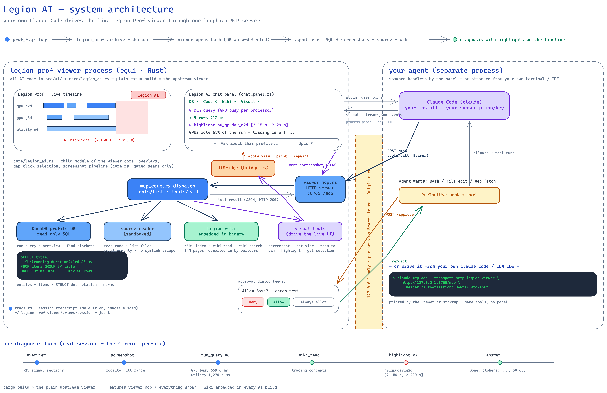

# Legion AI

Legion AI is an AI diagnostic co-pilot built into the Legion Prof timeline
viewer: it answers plain-English questions about Legion and Legate profiles
by running SQL over a DuckDB export, driving the live timeline (zoom, filter,
screenshots), and reading the profiled application's source. Diagnoses arrive
as clickable highlights on the timeline, grounded in a pre-computed overview
of ~25 diagnostic signal sections; every number the agent states is backed by
a query you can expand and copy from the transcript.

There are two ways to use it: the embedded chat panel inside the viewer
(click Legion AI, top right), or your own Claude Code — or any MCP-capable
agent or LLM IDE — connected to the viewer's local MCP server, with the same
tools available either way. The embedded panel is the default path below;
for the second, see
[Using your own agent over MCP](#using-your-own-agent-over-mcp-byoa).



> **Important:** This is a modified fork of
> [StanfordLegion/prof-viewer](https://github.com/StanfordLegion/prof-viewer)
> (Apache-2.0). A default build (`cargo build`) behaves exactly like upstream;
> everything else is feature-gated. Reviewers: see
> [For reviewers & development](#for-reviewers--development) and
> [docs/UPSTREAM-DELTA.md](docs/UPSTREAM-DELTA.md).

## Contents

- [Quick start](#quick-start)
- [Capabilities](#capabilities)
- [Using the co-pilot](#using-the-co-pilot)
- [Connecting your application source](#connecting-your-application-source)
- [Troubleshooting](#troubleshooting)
- [Architecture and security](#architecture-and-security)
- [Session traces](#session-traces)
- [Advanced](#advanced)
- [For reviewers & development](#for-reviewers--development)
- [License and acknowledgments](#license-and-acknowledgments)

## Quick start

The AI engine is your own Claude Code (≥ 2.1) with a Claude subscription or
`ANTHROPIC_API_KEY` — see [Launching the viewer](#launching-the-viewer);
without it, the viewer works as a plain timeline viewer.

### Building the viewer

Building requires Rust ≥ 1.85 (edition-2024 crate; run `rustup update`) and a
C/C++ toolchain for the bundled DuckDB build — `build-essential` on Linux,
`xcode-select --install` on macOS. To build the full AI viewer, run the
following commands:

```sh
# Linux only — GUI + build dependencies (Fedora list in Troubleshooting):
$ sudo apt-get install build-essential libxcb-render0-dev libxcb-shape0-dev \
      libxcb-xfixes0-dev libspeechd-dev libxkbcommon-dev libssl-dev

$ git clone https://github.com/ahmadzafar-code/legion-ai.git
$ cd legion-ai
$ cargo build --release --features viewer-mcp
```

The first build compiles DuckDB's C++ and takes 5–10 minutes; the result is
cached, so later builds are fast.

Prebuilt Linux (x86_64) and macOS (arm64) binaries — the full AI build — are
attached to tagged releases on the
[Releases page](https://github.com/ahmadzafar-code/legion-ai/releases) as
they are published.

> **Note:** The macOS binary is unsigned. After extracting, clear quarantine
> with `xattr -d com.apple.quarantine legion_prof_viewer`, or right-click →
> Open the first time.

### Profiling your application and converting the logs

Log conversion requires `legion_prof`, built from the same Legion source tree
your application runs on — `legion_prof` rejects logs from a mismatched
Legion version:

```sh
$ cargo install --locked --all-features --path <legion-source>/tools/legion_prof_rs
```

> **Note:** `--all-features` is required: the `duckdb` subcommand is not in
> `legion_prof`'s default feature set.

Run your application with Legion's profiler enabled, then convert the logs
into the viewer's two inputs:

```sh
$ ./my_app -lg:prof <N> -lg:prof_logfile prof_%.gz

$ legion_prof archive -o myrun_archive prof_*.gz   # timeline for the viewer
$ legion_prof duckdb  -o myrun_db      prof_*.gz   # database for the SQL tools
```

`archive` writes a directory; `duckdb` writes a single database file. Name
the database `<base>_db` next to `<base>_archive` and the viewer auto-detects
it — an exact `<base>_db` match wins; with several `*_db` / `*.duckdb` files
in one directory the pick is unspecified, so pass `--duckdb` to choose.

Legate and cuNumeric applications run on Legion, so the same flow applies:
pass the profiling flags through Legate's launcher
(`legate --profile --logging ... your_app.py`) and convert the resulting
`prof_*.gz` exactly as above. The co-pilot detects Python/Legate processors
and factors them into its diagnosis.

### Launching the viewer

The AI engine is your own Claude Code (≥ 2.1, plus `curl`). Install it from
[claude.com/claude-code](https://claude.com/claude-code) —
`npm install -g @anthropic-ai/claude-code` or the native installer — and run
`claude auth login` once; it uses your existing Claude subscription (Pro/Max)
or an `ANTHROPIC_API_KEY` in the environment, which the spawned CLI inherits.

```sh
$ ./target/release/legion_prof_viewer myrun_archive
```

Click Legion AI (top right) and ask, for example: "Give me an overview of
this profile — what ran, where the time went, and anything unusual."

If the welcome screen says Claude Code isn't signed in, run
`claude auth login` in any terminal; the hint flips to ready within seconds,
no restart needed.

If you normally run `legion_prof view`, this binary is the AI-enabled
replacement for that frontend: it reads the same archives, and the AI tools
exist only here.

### Driving it from your own Claude Code instead

The embedded panel is optional. At startup the viewer prints a ready-to-paste
`claude mcp add` registration; run it once and your own Claude Code session —
or any MCP-capable agent or LLM IDE — gets the same data, source, wiki, and
visual-timeline tools against the live viewer. See
[Using your own agent over MCP](#using-your-own-agent-over-mcp-byoa).

## Capabilities

- Time attribution: a pre-computed diagnostic overview (utilization, idle
  gaps, task rankings, critical-path signals) plus ad-hoc SQL over a DuckDB
  export of your profile answers "where did the time go?". Every number the
  agent states is backed by a query you can expand and copy from the
  transcript.
- Live timeline control: the agent zooms to a nanosecond range, filters
  processor kinds, scrolls to a row, searches, and captures screenshots that
  it reads as images.
- Timeline highlights: diagnoses arrive as labeled highlights on the
  timeline; manage them in the sidebar's highlight manager and click a chip
  to zoom to the evidence.
- Source reading: connect the profiled application's source and the agent
  explains what a slow task actually computes.
- Selection context: click a task bar or shift-drag a time range, then ask
  "what's happening here?"; the selection rides along as context.
- User control: a turn in flight stops with the square stop button, and any
  engine action that touches your machine (shell, file edits, web) raises a
  Deny / Allow / Always-allow dialog first.

## Using the co-pilot

Good first questions:

- "Give me an overview of this profile — what ran, where the time went, and
  anything unusual."
- "Highlight the largest idle gaps and find what's preventing that work from
  starting earlier."
- "Why is `update_voltages` so slow?" (connect your code first)
- Shift-drag a region on the timeline, then: "What's happening in this
  region?"

The agent narrates as it works: every tool call (`run_query`, `set_view`,
`highlight`, …) appears as an expandable row in the transcript, so you can
audit exactly which SQL produced which number.

The chat panel's controls:

| Control | What it does |
|---|---|
| Legion AI (top bar, right) | shows/hides the chat panel |
| Sidebar (top bar, left) | shows/hides the controls sidebar — more room for timeline + chat |
| DB / Code / Wiki / Visual chips | live status of the agent's tool groups; hover for detail |
| + menu (composer) | Connect DuckDB…, Connect Code…, Add file… (attach a text file as context) — connected items show as chips with × to disconnect |
| Model · Strength picker (composer) | model tier (Default / Fable / Opus / Sonnet / Haiku) and reasoning strength (Default / Low / Medium / High / Max). Default inherits your own Claude Code configuration; a change applies on your next message |
| Send / Stop | send when you've typed something; during a turn it becomes a square stop button — one click gracefully interrupts (the session survives, keep chatting) |
| ↺ (panel header) | hard reset: kills the engine process and starts a fresh session |
| Selection chip | click a task bar or shift-drag a range, and your next question includes it |
| Highlights (left sidebar) | every diagnosis the agent marks lands here — toggle, zoom to, or clear |
| Done. (tokens: …) | per-turn token and cost line, straight from the engine's own usage report |
| Copy transcript / Copy | export the conversation (screenshots elided as `[image … KB]` placeholders) |

## Connecting your application source

Use + → Connect Code… to point the agent at the profiled application's
source tree, or pass `--code <dir>` at launch. The agent then reads the
functions behind slow tasks and explains what they actually compute.
Connected paths persist across restarts; CLI flags win over persisted values.

> **Important:** Source the agent reads becomes conversation context. Connect
> only code you're comfortable sending to your configured model provider.

## Troubleshooting

Symptoms and fixes:

| Symptom | Fix |
|---|---|
| Welcome screen: "Claude Code isn't signed in yet" | run `claude auth login` in any terminal; the hint updates within seconds |
| First turn errors with 401 | same as above, then ↺ for a fresh session |
| Panel says Claude Code isn't available although it's installed | make sure `claude` resolves on the PATH of the shell that launched the viewer; when launching from Finder or an IDE, start from a terminal instead (or symlink `claude` into `/usr/local/bin`) |
| `cc` / `c++` not found during first build | `sudo apt-get install build-essential` (Linux) or `xcode-select --install` (macOS) |
| Error about `edition2024` / rustc version | `rustup update` (needs Rust ≥ 1.85) |
| `legion_prof duckdb` fails: unknown subcommand, or panics "not built with the duckdb feature" | reinstall with `cargo install --locked --all-features --path <legion-source>/tools/legion_prof_rs` — the `duckdb` feature is not a default, and the subcommand requires a Legion checkout from June 2025 or later |
| `legion_prof archive` / `duckdb` panics on your logs | `legion_prof` only reads logs from the Legion version it was built from — rebuild it from the source tree your application runs on |
| First `cargo build` takes ~10 minutes | DuckDB's C++ compiles once and is cached afterwards |
| No SQL tools / "DB ○" chip gray | pass `--duckdb`, use the naming convention from [the profiling step](#profiling-your-application-and-converting-the-logs), or + → Connect DuckDB… |
| Port 8765 in use | the viewer picks an ephemeral port and prints it; re-run the printed `claude mcp add` line if you registered an external agent |
| `The socket connection was closed unexpectedly` on one tool call | transient transport error; the viewer answers 408 and logs the cause to stderr — the agent retries and succeeds |
| Linux: viewer fails to start | install the GUI packages from [Building the viewer](#building-the-viewer); Fedora: `dnf install clang clang-devel clang-tools-extra speech-dispatcher-devel libxkbcommon-devel pkg-config openssl-devel libxcb-devel fontconfig-devel` |
| macOS: "cannot be opened" on a prebuilt binary | `xattr -d com.apple.quarantine legion_prof_viewer`, or right-click → Open |

## Architecture and security

Legion AI runs on your own Claude Code, spawned headless against a local MCP
server inside the viewer. Authentication is whatever your `claude` already
uses: a one-time `claude auth login` (Pro/Max subscription) or an
`ANTHROPIC_API_KEY` in the environment (inherited by the spawned CLI). There
is no separate account or server, and Legion AI itself adds no telemetry
(the spawned Claude Code CLI's own settings apply). A built-in direct-API
engine exists in the code but is currently disabled.

Security model, short version (full details in [SECURITY.md](SECURITY.md)):

- The MCP server binds `127.0.0.1` only, requires a per-session bearer token
  on every request, and rejects non-local `Origin`s.
- Engine tool calls that touch your machine (shell, file edits, web fetch)
  block on a Deny / Allow / Always-allow dialog in the viewer, showing the
  full command — never a truncated preview.
- The spawned Claude Code child runs with an isolated settings file and a
  neutral working directory, so repository-local `.claude/` configuration is
  never picked up implicitly.
- Profile data, timeline screenshots, and connected source are sent to the
  model (Anthropic API) as conversation context — connect only code you're
  comfortable sharing with your configured provider.

## Session traces

While this fork is in its evaluation phase, the viewer records a local
reasoning transcript of each chat session so the team can replay how a
diagnosis was reached and improve the product. On the first question of a
session it prints where the file lives:

```
[legion-ai] session trace: ~/.legion_prof_viewer/traces/session_<id>.jsonl
            (set LEGION_PROF_AI_TRACE=off to disable)
```

Recorded (JSON Lines): your prompts, the agent's narration and thinking,
every tool call with its full input (e.g. the exact SQL), tool results,
per-turn token usage/cost, stop clicks, and errors. Not recorded: screenshot
image bytes are replaced with an `[image … KB elided]` note, and nothing is
uploaded anywhere — the trace is a plain local file.

- `LEGION_PROF_AI_TRACE=off` (or `0`/`false`) disables tracing.
- `LEGION_PROF_AI_TRACE_DIR=<dir>` relocates the trace directory.
- To share with the team, zip `~/.legion_prof_viewer/traces/` and attach it
  to your feedback. Traces contain your prompts, profile-derived numbers, and
  any source snippets the agent read — skim before sharing if your
  application code is sensitive.

## Advanced

### Full CLI

Synopsis:

```sh
legion_prof_viewer <archive-dir-or-URL> \
    [--duckdb <path.duckdb>]   # profile database (skip if auto-detected)
    [--code   <dir>]           # profiled application's source
    [--wiki   <dir>]           # override the built-in Legion knowledge wiki
```

Everything passed by flag can also be connected later from the panel's +
menu; connected paths persist across restarts (CLI flags win when both
exist).

### Converting an archive to a database

If you have an archive but no `prof_*.gz` logs, convert it to a database
directly:

```sh
$ cargo run --release --features duckdb --example prof2duckdb -- \
    myrun_archive -o myrun_db
```

The DuckDB writer is shared with upstream prof-viewer (this fork does not
modify it), so any recent `legion_prof` produces a database with the schema
the tools expect.

### Knowledge wiki

The `wiki_*` tools serve a curated Legion-concepts corpus — task lifecycle,
mapper behavior, common bottleneck patterns — that the agent consults when
diagnosing. The corpus lives in this repository under [`wiki/`](wiki/) and is
embedded into the binary at build time, so it is available in every AI build
(including prebuilt release binaries) with no configuration. Pass
`--wiki <dir>` to serve a different corpus from disk instead; edits to that
directory take effect without a rebuild, which is the workflow for corpus
development.

### Using your own agent over MCP (BYOA)

The second way to use Legion AI: skip the embedded panel and drive the
profiler from the tool you already work in. The viewer runs a loopback-only
HTTP MCP server exposing the data, source, wiki, and visual-timeline tools;
at startup it prints a ready-to-paste registration:

```sh
$ claude mcp add --transport http legion-viewer \
    http://127.0.0.1:8765/mcp --header "Authorization: Bearer <token>"
```

Any MCP-capable client can drive the profiler through it — Claude Code in a
terminal, an LLM IDE, or a custom agent. Ask questions in that client and it
queries, navigates, and highlights the live timeline exactly as the embedded
panel does. The bearer token is
random per session; set `LEGION_VIEWER_MCP_TOKEN` for a stable registration.
Port 8765 is preferred, with an ephemeral fallback (the real port is printed
at startup).

A headless stdio variant (data tools only, no GUI) ships as the `mcp` bin:

```sh
$ cargo run --features ai,duckdb --bin mcp -- --duckdb <db> [--code-root <dir>]
```

## For reviewers & development

All AI code lives in `src/ai/`, `src/bin/`, and `src/app/core/legion_ai.rs`
(a child module holding every AI addition to the viewer core — upstream files
carry only thin `#[cfg(feature = "ai")]`-gated call sites).
[docs/UPSTREAM-DELTA.md](docs/UPSTREAM-DELTA.md) maps the full delta against
upstream and how to review it.

| Build | What you get |
|---|---|
| `cargo build` | the plain upstream viewer (no AI) |
| `--features ai` | chat panel + UI (the engine requires Claude Code, enabled by `viewer-mcp`) |
| `--features ai,duckdb` | + DuckDB data tools (`run_query`, overview, …) |
| `--features viewer-mcp` | + in-viewer MCP server + the Claude Code engine (implies `ai,duckdb`) — the recommended build |
| `--features eval` | + the oracle-graded eval harness (`eval` bin; maintainers) |

```sh
$ cargo check --features ai,duckdb
$ cargo clippy --features ai,duckdb -- -W clippy::all
$ cargo test  --features ai,duckdb
# claude_code.rs / viewer_mcp.rs compile ONLY under viewer-mcp:
$ cargo test  --features viewer-mcp
```

All five feature combinations must compile: `{}`, `{ai}`, `{duckdb}`,
`{ai,duckdb}`, `{viewer-mcp}`. See [CONTRIBUTING.md](CONTRIBUTING.md).

## License and acknowledgments

Apache-2.0, same as upstream — see [LICENSE.txt](LICENSE.txt). Built on the
[Legion](https://legion.stanford.edu/) ecosystem and the
[StanfordLegion/prof-viewer](https://github.com/StanfordLegion/prof-viewer)
frontend (original README preserved at
[docs/UPSTREAM-README.md](docs/UPSTREAM-README.md)); the AI layer talks to
[Anthropic](https://www.anthropic.com/)'s Claude models via your own Claude
Code install or API key.
